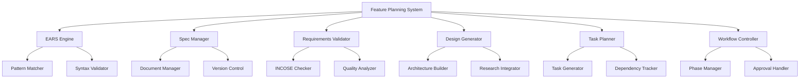

# Design Document

## Overview

The Structured Feature Planning system provides a comprehensive framework for transforming feature ideas into production-ready implementations through a systematic workflow. The system integrates EARS methodology, INCOSE quality standards, and iterative development practices to ensure high-quality feature development within the RPi Simulator ecosystem.

## Architecture

### Core Components



### System Integration

The Feature Planning System integrates with existing Kiro infrastructure:
- **Spec Management**: Leverages `.kiro/specs/` directory structure
- **File Operations**: Uses Kiro's file system tools for document management
- **User Interaction**: Integrates with Kiro's user input mechanisms
- **Task Execution**: Connects with Kiro's task execution framework

## Components and Interfaces

### EARS Engine

**Purpose**: Validates and formats requirements using EARS patterns

**Interface**:
```python
class EARSEngine:
    def validate_pattern(self, requirement: str) -> EARSPattern
    def format_requirement(self, user_story: str) -> List[str]
    def check_compliance(self, requirements: List[str]) -> ValidationResult
```

**Key Methods**:
- Pattern recognition for six EARS types (Ubiquitous, Event-driven, State-driven, etc.)
- Automatic formatting suggestions for non-compliant requirements
- Clause ordering validation for complex requirements

### Spec Manager

**Purpose**: Manages specification documents and their lifecycle

**Interface**:
```python
class SpecManager:
    def create_spec(self, feature_name: str) -> SpecDirectory
    def load_spec(self, feature_name: str) -> SpecDocuments
    def update_document(self, doc_type: DocumentType, content: str) -> bool
    def validate_structure(self) -> StructureValidation
```

**Key Features**:
- Automatic directory creation in `.kiro/specs/{feature_name}/`
- Document versioning and backup
- Cross-reference validation between requirements, design, and tasks

### Requirements Validator

**Purpose**: Ensures INCOSE compliance and quality standards

**Interface**:
```python
class RequirementsValidator:
    def check_incose_rules(self, requirement: str) -> List[QualityIssue]
    def validate_glossary(self, terms: Dict[str, str]) -> GlossaryValidation
    def ensure_completeness(self, requirements: List[Requirement]) -> CompletenessReport
```

**Validation Rules**:
- Active voice enforcement
- Vague term detection ("quickly", "adequate")
- Escape clause identification
- Measurability verification
- Terminology consistency

### Design Generator

**Purpose**: Creates detailed technical designs from requirements

**Interface**:
```python
class DesignGenerator:
    def generate_architecture(self, requirements: List[Requirement]) -> ArchitectureDoc
    def create_interfaces(self, components: List[Component]) -> InterfaceSpec
    def define_data_models(self, entities: List[Entity]) -> DataModelSpec
    def plan_testing_strategy(self, requirements: List[Requirement]) -> TestStrategy
```

**Design Sections**:
- System architecture with component diagrams
- Interface specifications and API contracts
- Data models and relationships
- Error handling strategies
- Testing approaches and validation methods

### Task Planner

**Purpose**: Converts designs into actionable implementation tasks

**Interface**:
```python
class TaskPlanner:
    def generate_tasks(self, design: DesignDocument) -> TaskList
    def create_dependencies(self, tasks: List[Task]) -> DependencyGraph
    def mark_optional_tasks(self, tasks: List[Task]) -> TaskList
    def validate_completeness(self, tasks: List[Task], requirements: List[Requirement]) -> ValidationReport
```

**Task Generation Rules**:
- Maximum two-level hierarchy (parent tasks and sub-tasks)
- Incremental build approach
- Requirement traceability
- Optional task marking with "*" suffix
- Coding-focused activities only

### Workflow Controller

**Purpose**: Manages the iterative development process

**Interface**:
```python
class WorkflowController:
    def get_current_phase(self) -> WorkflowPhase
    def request_approval(self, phase: WorkflowPhase) -> ApprovalResult
    def transition_phase(self, from_phase: WorkflowPhase, to_phase: WorkflowPhase) -> bool
    def handle_feedback(self, feedback: UserFeedback) -> ActionPlan
```

**Workflow States**:
- Requirements gathering and validation
- Design creation and review
- Task planning and approval
- Implementation execution

## Data Models

### Requirement Model
```python
@dataclass
class Requirement:
    id: str
    user_story: str
    acceptance_criteria: List[str]
    ears_pattern: EARSPattern
    referenced_terms: List[str]
    validation_status: ValidationStatus
```

### Design Document Model
```python
@dataclass
class DesignDocument:
    overview: str
    architecture: ArchitectureSpec
    components: List[ComponentSpec]
    interfaces: List[InterfaceSpec]
    data_models: List[DataModel]
    error_handling: ErrorHandlingStrategy
    testing_strategy: TestingStrategy
```

### Task Model
```python
@dataclass
class Task:
    id: str
    title: str
    description: str
    requirements_refs: List[str]
    dependencies: List[str]
    is_optional: bool
    status: TaskStatus
    sub_tasks: List['Task']
```

## Error Handling

### Validation Errors
- **EARS Pattern Violations**: Provide specific correction suggestions
- **INCOSE Rule Violations**: Highlight problematic phrases with alternatives
- **Missing Glossary Terms**: Auto-detect undefined technical terms
- **Incomplete Requirements**: Identify coverage gaps

### Workflow Errors
- **Phase Transition Failures**: Prevent progression without explicit approval
- **Document Inconsistencies**: Flag mismatches between requirements and design
- **Task Generation Failures**: Ensure all requirements are covered by tasks

### Recovery Strategies
- **Automatic Backup**: Preserve previous versions during iterations
- **Rollback Capability**: Return to previous approved states
- **Incremental Validation**: Check compliance at each modification

## Testing Strategy

### Unit Testing
- EARS pattern recognition accuracy
- INCOSE rule validation correctness
- Document generation completeness
- Workflow state transitions

### Integration Testing
- End-to-end spec creation workflow
- Cross-document consistency validation
- User interaction flow testing
- File system integration verification

### Validation Testing
- Real-world feature specification scenarios
- Complex requirement handling
- Multi-iteration workflow testing
- Error recovery and rollback testing

### Performance Testing
- Large specification handling
- Concurrent user workflow management
- Document parsing and validation speed
- Memory usage optimization